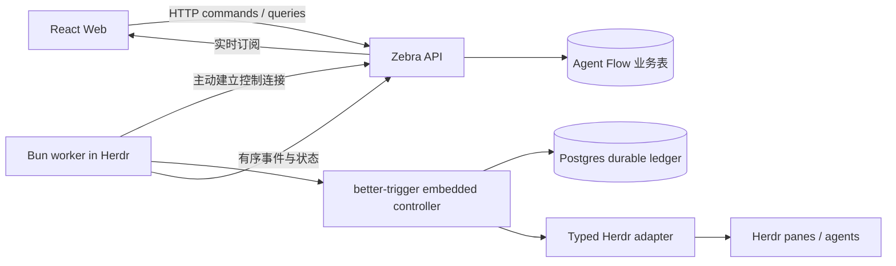

# Agent Flow 项目初始化与首版产品方案

日期：2026-09-05。状态：初始化已落地，以下产品功能待实施。本次不拆 todos、不自动执行后续阶段。

## 意图

把任务管理与本地 coding agent 执行连接起来。Web 是类似 Linear 的工作空间，用来组织项目、任务、执行进度和人工介入；worker 作为 Bun 常驻进程运行在 Herdr pane 内，控制 Herdr 并承载 better-trigger durable workflow。工程采用 Bun + Turborepo，前端使用 React + Vite + TanStack，HTTP 服务使用 Zebra，DOM 测试使用 mad-dom。

先建立可运行、可验证的工程骨架，再按纵向闭环实现“创建任务 → 选择 worker → 发起执行 → 查看进展 → 审核结果”。

## 已确认约束与默认假设

| 项目 | 决策 | 依据 |
| --- | --- | --- |
| 包管理与运行时 | Bun 1.4.0 起步，只保留 bun.lock | 用户指定 Bun，本地三个库也以 Bun 开发 |
| Monorepo | Turborepo + Bun workspaces | 用户指定 |
| Web | React + Vite；TanStack Router、Query | 用户指定前三项；Router/Query 为本轮默认 |
| Web server | Zebra | 用户指定 `../zebra`；已验证其 `get/listen/dispatch` API |
| Durable controller | better-trigger embedded runtime | 用户指定 `../better-trigger`；支持在长驻 Bun 进程内运行 |
| 数据库 | PostgreSQL；业务 schema 与 runtime 内部表分离 | better-trigger runtime 已依赖 Postgres；不能以 SQLite 替换它 |
| 执行位置 | Herdr 内的本地 Bun worker | 用户明确 worker 会控制 Herdr |
| DOM | mad-dom | 用户指定 `../mad-dom`；原生模块已能在当前机器加载 |
| 首版范围 | 单用户、本地单 worker、并发 1 | 尚未收到拓扑偏好确认，作为可调整的 MVP 假设 |
| UI 与 ORM | 初始 CSS；业务 ORM 未选定 | 用户尚未指定，业务持久化阶段再决定 |

参考证据：

- `../zebra/README.md`：Bun-first、DI、HTTP routing、contract-first、WebSocket、in-process testing。`app.ws` 的 upgrade 不经过普通 HTTP middleware。
- `../better-trigger/README.md`、`apps/worker/README.md`：SDK 是客户端，runtime 持有 Postgres；embedded host 负责 migration、claim、heartbeat、replay 和 shutdown；一进程只支持一个 embedded runtime。
- `../better-trigger/packages/sdk/package.json`、`apps/worker/package.json`：SDK 和 embedded exports 指向构建后的 dist。
- `../mad-dom/docs/testing.md`：显式 Window、最小 DOM globals、异步清理；不承诺任意框架 renderer 的完整兼容性。
- 当前 Herdr CLI 与 skill：worker 必须继承 Herdr caller context；操作使用明确返回的 ID；`unknown` 不能视为成功，`blocked` 需要进入人工处理。
- [TanStack Router 文档](https://tanstack.com/router/latest/docs/quick-start)、[Vite 文档](https://vite.dev/guide/)、[Turbo 环境变量与缓存](https://turborepo.dev/docs/crafting-your-repository/using-environment-variables)、[Bun link](https://bun.sh/docs/pm/cli/link)。

## 目标与非目标

首版目标：

1. 创建项目及任务，展示列表、详情、状态、优先级和执行历史。
2. 注册一个 Herdr worker，展示在线状态、当前执行和需要人工处理的事项。
3. 从 Web 触发一条内置 workflow，在明确的 repo/工作目录中启动受支持的 agent。
4. 持久记录 run、step、事件和产物引用；支持重启恢复、重复请求去重和明确的失败状态。
5. Web 实时查看进展，并对阻塞、取消和重试做出操作。

首版不包含团队权限、计费、完整 Linear 功能、可视化 workflow 编排器、多机全局调度、自动合并或部署。用户的现有 Herdr pane/agent 不作为可回收资源。多用户与远程多 worker 将在单 worker 的恢复语义稳定后推进。

## 本轮初始化成果

```text
apps/web        React + Vite + Router + Query；任务/执行/worker 预览路由
apps/server     Zebra；GET /api/health；配置与入口
apps/worker     Herdr 环境诊断；better-trigger embedded host；smoke 命令
packages/contracts   浏览器安全的健康响应类型
packages/herdr       caller context 校验、固定 argv、超时与错误处理
packages/workflows   带 payload 校验的纯 smoke task
scripts/link-local.ts 本地构建检查和 Bun 名称链接注册
```

根目录已建立 Git main、Bun lockfile、Turbo task graph、共享 TypeScript 配置、Biome 和开发脚本。Web/API 可独立于数据库运行；worker 的数据库执行需要额外配置。

这里的健康 API 只证明 Web server 存活。当前空页面不是持久化数据；worker 尚未注册到 API，也没有创建 pane、发送 prompt、建立 Web 控制接口。

## 整体方案



该图是目标拓扑。初始化只连接了 Web → API 以及 worker → embedded runtime 的入口。

### 模块职责与依赖

- `apps/web` 只依赖浏览器安全的 contracts。Router 管路由与 URL 状态，Query 管请求缓存、mutation 和失效；需要表格、表单和虚拟列表时再加对应 TanStack 包。
- `apps/server` 负责项目/任务 CRUD、worker 注册、run 请求、业务状态投影和实时订阅；按 Zebra service/DI 组织。通过协议请求 worker 调度，HTTP handler 不运行 Herdr CLI。
- `apps/worker` 持有本地 repo 配置、Herdr caller context、控制连接和一个 embedded runtime。它以 runtime client 提交和观察任务，负责协议边界与资源生命周期。
- `packages/workflows` 定义内置 workflow 及稳定 step 名称；Herdr 实现经显式依赖/工厂注入，避免 workflow 定义隐式读取调用者焦点。
- `packages/herdr` 是唯一的 Herdr CLI 出口：命令白名单、argv、明确目标、timeout、JSON 输出解析、错误映射与资源归属检查。
- `packages/contracts` 后续增加 runtime schema、错误码和版本化消息。只共享序列化 DTO，不向浏览器导出数据库、Bun、Herdr 或 workflow runtime 模块。
- 业务持久化出现后增加 `packages/db`。MVP 可与 runtime 使用同一个开发 Postgres 实例，但以独立 schema/migration 维护；不让产品逻辑直接写 better-trigger 内部表。

### Web → worker 控制通道

采用 worker 主动连接 Zebra 的 WebSocket，避免以后远程 worker 必须开放入站端口。本地 MVP 也走同一协议。首轮连接支持注册、心跳、容量、任务提交和事件回传；浏览器通过 API 获取状态，不直接持有 Herdr 控制凭证。

在 `packages/contracts` 定义协议版本及最小 envelope：`type`、`requestId`、`workerId`、`runId`、`sequence`、`payload`。服务端保留待交付命令及 ack 状态；worker 以稳定 `requestId` 去重。重连携带上次确认游标，重发未确认命令并补传事件。只允许合法的状态迁移，重复事件不重复写业务结果。

初始化尚未实现认证。接入控制能力时添加一次性配对凭证与 worker token；Zebra 的 WS upgrade 必须在 `onUpgrade` 中验证身份，不能假设普通 HTTP middleware 已执行。默认只绑定 loopback；远程部署前补全 Web 用户认证、来源校验和传输加密。

### 领域模型

| 实体 | 关键字段 / 责任 |
| --- | --- |
| Project | id、名称、repo 配置；本地路径由 worker 解析 |
| Issue | id、projectId、标题、描述、优先级、status；支持多个历史 run |
| Worker | 稳定 id、名称、在线状态、capabilities、heartbeat、capacity |
| Run | issueId、workerId、workflowVersion、idempotencyKey、runtimeRunId、status、错误和产物摘要 |
| RunEvent | runId、sequence、type、timestamp、结构化 payload |
| HerdrOperation | runId、operationId、phase、明确资源 ID、command intent、结果或待核对状态 |

Issue 状态与 Run 状态分开。任务管理可以用 backlog/todo/in-progress/in-review/done；Run 用 queued/running/blocked/succeeded/failed/cancelled，断线另记录连接/核对状态，不能立刻把运行判定为失败。better-trigger run 状态不一定能表达 agent 的 `blocked`，由业务事件投影补充。

任务执行请求先与服务端 outbox 在同一业务事务中提交，再交付 worker；worker 用稳定幂等键触发 runtime。这样覆盖“服务端已记录、连接突然中断”和“runtime 已触发、ack 丢失”的窗口。

### Workflow 与恢复语义

首版只做一条版本化内置流程：

1. 校验 Issue、repo 配置和 worker 能力，获得针对 repo/执行槽位的 lease。
2. 准备明确的工作目录；按项目策略创建隔离 worktree 与由本 run 拥有的 pane。
3. 启动指定种类的 agent；参数由结构化配置产生，使用 Herdr 实际返回的身份和 pane ID。
4. 发送任务说明，观察 agent 状态及输出，增量回传事件。
5. 进入 blocked 时暂停推进，展示需用户处理的信息；不知道状态时核对现场。
6. 执行配置的检查、汇总差异和产物，进入待审核状态；保存结果后按策略清理本 run 拥有的资源。

better-trigger 的 step ledger 可恢复流程进度，不能把外部 Herdr 操作自动变成 exactly-once。每个 mutation 先持久记录 operation intent，再执行并保存 returned IDs。重放先核对记录与 Herdr 现场。若“创建成功、保存结果前崩溃”且现有 CLI 无法可靠关联该资源，进入人工核对状态，不盲目重新创建、重新 prompt 或清理资源。

完成判断结合 agent 状态、检查命令结果与产物，不能仅凭 `idle/done` 推断业务成功。取消需要同时记录业务 intent、请求 runtime 停止推进，并针对 owned agent/pane 完成停止核对；仅取消 runtime 不保证外部进程已经退出。

workflow 在初版固定于单 worker。扩展多机前必须决定 worker affinity：多个 runtime 共享同一 namespace 会共同抢任务，不能假设指定 worker 的任务自然只在该机器执行。应采用有明确归属的 namespace/queue 或单独 controller 分发模式，并加跨 worker 领取测试。

### 前端体验

先完成任务列表与详情、运行详情、worker 页面。URL 保存项目和筛选条件；Query mutations 完成后精确失效相关查询。网络事件按 run 与 sequence 更新缓存，重连后重新获取快照。终端大日志分段加载，后续再引入虚拟列表。

状态要表达 queued、执行中、等待用户、连接中断、失败和结果待审核。展示真实空状态与错误，不把 worker 断线显示为成功。UI 组件库、主题方案和是否采用 TanStack Table/Form 在实现 CRUD 时确认。

## 拆解与依赖

| 阶段 | 内容 | 依赖 | 难度 | 验收 |
| --- | --- | --- | --- | --- |
| M0 | 完成本地依赖和测试兼容基线；独立 Postgres 上验证 embedded smoke | 当前初始化 | medium | clean setup 可复现；数据库 smoke 有真实 completed run |
| M1 | 业务 schema/migrations、contracts、项目与任务 CRUD、最小列表/详情 | M0 | medium | 新建任务刷新后仍存在；输入校验/状态迁移正确 |
| M2 | worker 稳定身份、配对、WS 注册/heartbeat、outbox/ack/重连 | M1 | hard | 断网恢复后去重交付；离线状态准确 |
| M3 | typed Herdr mutation adapter、资源归属与 operation ledger | M0；持久化依赖 M1 | hard | 在隔离测试会话里创建/读取/停止 owned 资源；不触碰其他资源 |
| M4 | 内置 workflow、运行状态投影、幂等、blocked/取消/恢复 | M2、M3 | hard | Web 提交任务后 Herdr 执行；重启不重复副作用；失败可解释 |
| M5 | 执行详情、实时日志、人工处理与审核、交互细节 | M4；UI框架可与 M2/M3 并行 | medium | 在 Web 完成创建、执行、观察、处理阻塞、审核闭环 |
| M6 | 固定依赖发布物、CI、隔离集成测试、恢复演练与开发说明 | M0–M5 | hard | 新机器无需绝对路径即可准备；关键断点恢复测试通过 |
| Roadmap | 远程多 worker、多用户、权限、容量调度、自动化交付策略 | M6 与使用反馈 | hard | 另行方案与验收，不进入首版 |

推进顺序：M0 → M1 → (M2、M3 并行) → M4 → M5 → M6。先打通一条真实 workflow，再扩展流程种类和调度策略。

## 校验与验收

当前仓库命令：

```sh
bun run setup:local
bun install --frozen-lockfile
bun run lint
bun run typecheck
bun run test
bun run build
bun dev
bun run worker:check
# 配置独立开发 DATABASE_URL 后，在 Herdr 中执行：
bun run worker:smoke
```

首版测试分层：

- Bun 单测验证 schema、状态机、命令参数/ownership、去重和事件顺序。
- Zebra dispatch 测试覆盖业务 HTTP，WebSocket 用实际 listener 检查 upgrade 身份校验与重连。
- mad-dom 验证支持范围内的 DOM 与 React 交互；真实浏览器验证 layout、焦点、拖拽和长列表。DOM 模拟不代替浏览器验收。
- 单独的 Postgres 集成套件覆盖迁移、trigger、step replay、租约与故障恢复，使用隔离数据库，不依赖常驻个人数据。
- Herdr 集成在专用测试会话/owned pane 中进行，覆盖重复提交、claim 后崩溃、创建 pane 后崩溃、prompt 后断连、blocked、取消和 worker 重启。

本轮没有配置 PostgreSQL，因此不把初始化的 build/test 结果视为 durable 执行、Herdr mutation 或端到端产品完成。

## 风险、假设与后续需确认项

1. **依赖发布物**：better-trigger npm 尚无发布物，mad-dom JS/native 版本尚不齐，当前使用本地链接。链接依赖外部构建与 Bun 全局注册，lockfile 无法锁定其源码；M6 前应固定可复现发布物/构建版本，不直接添加无法跑通的 CI。
2. **Zebra 类型发布**：1.0.0 直接发布 TS 源码，其中存在非 type-only 类型导入。server 单独关闭 `verbatimModuleSyntax`，保留其他 strict 检查；上游修复后可恢复。
3. **mad-dom React 兼容**：当前本地 Window 未暴露 React 19 使用的 `HTMLIFrameElement`，测试 preload 已从真实 iframe 元素取得构造器并补充映射；部分语义元素仍被识别为 HTMLUnknownElement，保留 React 的警告。当前测试仅验证本应用挂载/导航，不代表 iframe、焦点等完整兼容；上游修复后移除适配。
4. **数据库位置**：本轮按本地单 worker 假设。Web/API 远程、数据库分离或多 worker 会影响控制通道、凭证与调度归属，扩展前需要明确。
5. **非幂等副作用**：runtime 恢复与 Herdr 执行不在一个事务；必须保留不确定状态与人工核对路径，不能承诺外部动作绝对只执行一次。
6. **流程与产品细节**：首条 workflow 用哪个 agent、是否默认 worktree、检查命令如何配置、是否需要规划/审核多 agent 阶段，都尚未由用户指定。先以单 agent 执行 + 人工审核为默认。
7. **UI / ORM / Auth**：尚未指定额外库。单用户本地原型不预先加入团队系统；控制通道与远程暴露阶段仍需对应的身份和访问边界。

如果用户确认从第一天需要团队协作或远程多 worker，应先修订 M1/M2 的身份、权限、数据库拓扑和调度归属，再实施业务功能。
